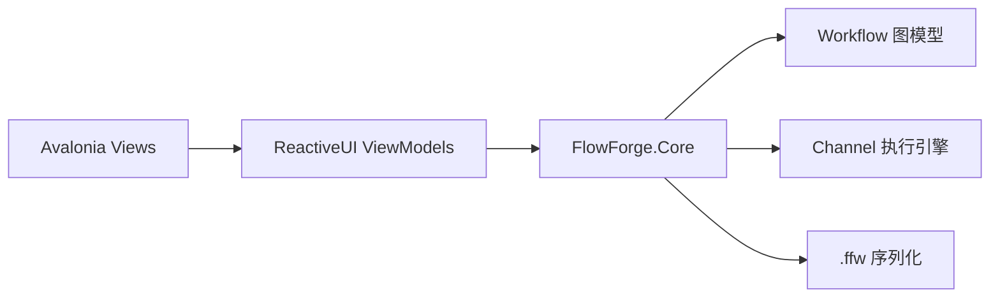

# FlowForge

FlowForge 是一个本地运行的节点式 AI 工作流编辑器，使用 Avalonia 和 .NET 8 构建。当前已完成 Stage 5 的画布性能、节点目录、属性面板和插件工程化能力；运行仍完全在本地完成。

## 已实现能力

- 自绘画布支持节点投放、拖动、多选、端口类型校验和贝塞尔连线。
- Core 层提供受控 `Workflow` 聚合、Kahn 拓扑排序、基于 Channel 的流式调度、取消和失败传播。
- 内置 CSV/文本数据源、JSON 解析、文本拼接、控制台输出、OpenAI 与 DeepSeek 节点。
- `.ffw` schema v1 支持节点位置、配置和连线的加载保存，并提供 v0→v1 迁移框架。
- 文件菜单提供新建、打开、保存和另存为；Ctrl+Z、Ctrl+Y、Ctrl+Shift+Z 支持撤销重做。
- API Key 只通过 `apiKeySecretId` 引用保存，Windows 使用 DPAPI，macOS/Linux 通过系统密钥服务适配器处理。
- 画布使用统一 world/view 坐标、0.25x–4x 视口导航、自适应网格、节点/贝塞尔边剔除和按节点/边拆分的 retained draw operation。
- `--perf` 提供确定性的 100/250/500/1000 节点压力场景、5 秒预热、30 秒自动平移、1 秒采样、FPS HUD 和 JSON 输出。
- `NodeRegistry` 同时服务 Toolbox、`.ffw` 打开保存、运行、属性面板和插件；内置 Foreach、Regex Extract、File Writer 节点使用真实 Workflow 执行。
- 属性面板依据 Core 的 `[ConfigField]` 元数据生成六类编辑器；Password 只保存稳定 secret reference，不把明文写入 `.ffw`。
- 插件通过显式 `INodePlugin` 注册，使用可卸载 `AssemblyLoadContext` 隔离依赖；`plugins` 目录中的坏 DLL 只产生诊断，不阻断应用启动。

## 架构



## 快速开始

```powershell
dotnet restore
dotnet run --project src/FlowForge.App/FlowForge.App.csproj
dotnet test FlowForge.sln --configuration Release
```

## 性能证据

Release 实窗测量使用固定窗口 1200 × 760、seed `20260803`、5 秒预热、30 秒自动平移和每秒一个实际 Render 样本。测量代码提交为 `b0005bf`：

| 节点数 | 平均 FPS | 峰值 WorkingSet64 |
|--------|---------:|------------------:|
| 100 | 67.135 | 273,076,224 bytes |
| 250 | 68.102 | 277,299,200 bytes |
| 500 | 68.314 | 281,767,936 bytes |
| 1000 | 68.216 | 290,734,080 bytes |

完整 JSON、环境信息、BenchmarkDotNet 摘要和 Chart.js 图表见[性能报告](docs/perf/fps-vs-node-count.html)，1000 节点窗口截图见 `docs/perf/flowforge-1000-b0005bf.png`。运行入口为：

```powershell
dotnet run --project src/FlowForge.App/FlowForge.App.csproj --configuration Release -- --perf --nodes 1000 --output artifacts/perf/fps-1000.json
```

## 示例工作流

- `samples/csv-to-console.ffw`：读取 CSV 后流式输出到控制台。
- `samples/csv-summarize-with-llm.ffw`：读取包含 CSV 内容的提示词，交给 OpenAI 节点生成摘要，再输出到控制台。

第二个样例不包含明文 API Key。运行前请把对应 Key 存入系统密钥存储，并让节点配置中的 `apiKeySecretId` 指向该引用。集成测试使用 fake HTTP 与内存密钥存储，不会调用真实模型服务。

## 当前边界

Stage 5 已覆盖视口导航与剔除、retained scene、压力场景、BenchmarkDotNet 基准、FPS HUD、剩余内置节点、统一节点目录、属性编辑器、覆盖率 gate 和插件加载。ADR-0004 记录了 Avalonia 11.2.3 的 renderer 边界：公开 `SceneInvalidated` 为 root 级通知，局部失效由实际 dirty tracker 诊断证据验证。

## 关键决策

- [ADR-0003](docs/decisions/0003-core-execution-contracts.md)：Channel 流式执行与核心图模型。
- [ADR-0007](docs/decisions/0007-stage4-persistence-and-security-contracts.md)：密钥引用、`.ffw` 持久化和撤销历史。
- [ADR-0004](docs/decisions/0004-viewport-virtualization.md)：视口导航、剔除和 retained 增量绘制。
- [ADR-0005](docs/decisions/0005-plugin-loading-isolation.md)：插件显式注册、依赖隔离和卸载边界。

## 协议

MIT
