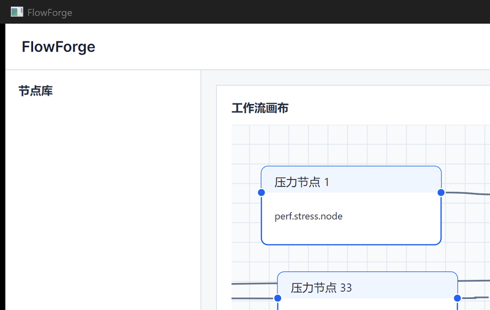
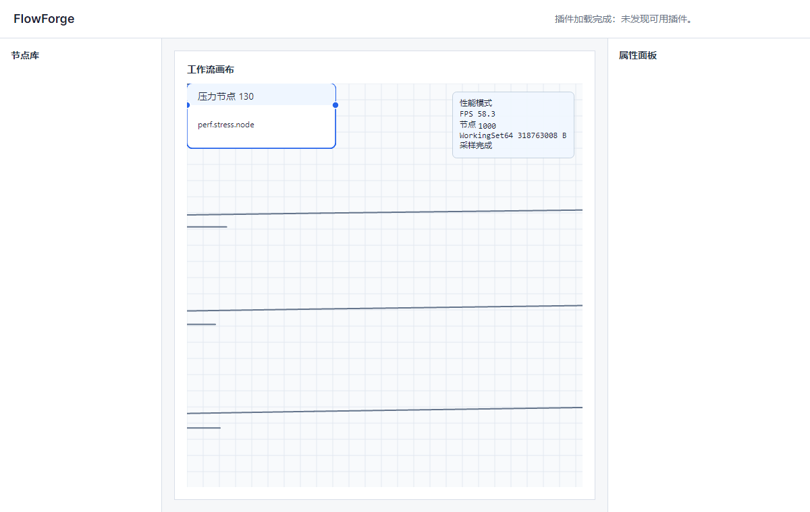
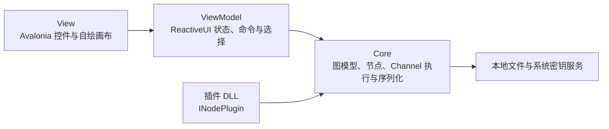

<p align="center">
  
</p>

<p align="center">
  
</p>

# FlowForge

FlowForge 是一款面向本地执行的节点式可视化 AI 工作流编辑器：在 Avalonia 画布上拖拽节点、连接数据端口，再沿 DAG 流式运行工作流。

- 用统一的 `NodeRegistry` 连接 Toolbox、画布、序列化、运行时和插件节点。
- 用强类型端口、每边独立 `Channel` 和协作式取消实现可观察的流式执行。
- 用 world/view 视口、节点与连线剔除、retained draw operation 支撑 1000 节点性能场景。

## 30 秒了解项目

GIF 演示展示真实 Avalonia 窗口中的压力画布和视口移动；静态截图保留了性能 HUD 和三栏编辑器结构。完整架构见[架构总览](docs/architecture.md)，节点扩展规则见[节点协议](docs/node-protocol.md)。

## 已实现能力

- 自绘画布支持节点投放、拖动、多选、端口类型校验、贝塞尔连线、0.25x–4x 缩放和空格/中键平移。
- Core 层提供 `Workflow` 聚合、Kahn 拓扑排序、基于 Channel 的流式调度、取消和失败传播。
- 内置 CSV/文本数据源、JSON 解析、文本拼接、遍历、正则提取、文件写入、控制台输出、OpenAI 与 DeepSeek 节点。
- `.ffw` schema v1 保存节点位置、稳定类型标识、配置和连线，并提供 v0→v1 迁移入口。
- 文件菜单提供新建、打开、保存和另存为；Ctrl+Z、Ctrl+Y、Ctrl+Shift+Z 支持撤销重做。
- API Key 只保存 `apiKeySecretId` 引用；Windows 使用 DPAPI，macOS/Linux 使用系统密钥服务适配器。
- 属性面板依据 `[ConfigField]` 元数据生成编辑器；Password 字段不把明文写入工作流文件。
- 插件必须显式实现 `INodePlugin`，由可卸载 `AssemblyLoadContext` 隔离依赖；坏插件只形成诊断，不阻断应用启动。

## 架构



## 快速开始

```powershell
dotnet restore
dotnet run --project src/FlowForge.App/FlowForge.App.csproj
dotnet test FlowForge.sln --configuration Release
```

运行应用不需要云端服务。若使用 LLM 节点，请先把密钥写入当前操作系统的密钥存储，并在节点配置中填写不透明的 `apiKeySecretId`；不要把 API Key 写进 `.ffw` 或提交到仓库。

## 示例工作流

- [`samples/csv-to-console.ffw`](samples/csv-to-console.ffw)：读取仓库内 CSV 后流式输出到控制台。
- [`samples/csv-summarize-with-llm.ffw`](samples/csv-summarize-with-llm.ffw)：读取提示文件，调用 OpenAI 节点生成摘要，再输出到控制台。该样例不包含明文 API Key。
- [`samples/log-extract-classify.ffw`](samples/log-extract-classify.ffw)：读取日志、提取结构化字段、拼接分类提示并输出结果。

更多字段与迁移规则见[工作流 schema 规范](docs/workflow-schema.md)。

## 性能证据

Release 实窗测量使用固定窗口 1200 × 760、seed `20260803`、每档 5 秒预热、随后 30 秒自动平移和每秒一个实际 Render 样本。下表是仓库当前已归档的真实窗口基线，原始 JSON 与环境信息见[性能报告](docs/perf/fps-vs-node-count.html)：

| 节点数 | 平均 FPS | 峰值 WorkingSet64 |
|--------|---------:|------------------:|
| 100 | 67.135 | 273,076,224 bytes |
| 250 | 68.102 | 277,299,200 bytes |
| 500 | 68.314 | 281,767,936 bytes |
| 1000 | 68.216 | 290,734,080 bytes |

性能场景入口：

```powershell
dotnet run --project src/FlowForge.App/FlowForge.App.csproj --configuration Release -- --perf --nodes 1000 --output artifacts/perf/fps-1000.json
```

上表记录的是已有性能归档；最终 Stage 6 性能复测会在最终应用 commit 上生成新的带 commit hash 的证据文件。启动时间、工作流加载时间、LLM 首次响应延迟和跨平台 GUI 启动不在本 README 中冒充已验证指标。

## 关键技术决策

- [ADR-0003：Channel 执行契约](docs/decisions/0003-core-execution-contracts.md)
- [ADR-0004：视口导航、虚拟化与增量绘制](docs/decisions/0004-viewport-virtualization.md)
- [ADR-0005：插件加载隔离与节点注册](docs/decisions/0005-plugin-loading-isolation.md)
- [ADR-0006：性能预算策略](docs/decisions/0006-performance-budget.md)
- [ADR-0007：持久化与安全契约](docs/decisions/0007-stage4-persistence-and-security-contracts.md)

## 路线图

- v0.2：补充更多数据源与转换节点，完善执行检查器、失败节点重试策略和可导出的运行日志。
- v0.3：完善插件开发模板、工作流调试体验和更细粒度的跨平台发布验证。

## What I learned

第一，Channel 流式调度的难点不在于启动并发任务，而在于定义每条边的完成、失败和取消语义。把边做成独立 Channel，并让调度器统一完成输出和传播异常，才能让上游持续产出时下游立即消费，同时避免节点之间共享不可见状态。这也让我把完成、失败和取消传播固化成可测试的协议，而不是散落在每个节点里。

第二，Avalonia 自绘画布的性能不能只靠一次性绘制优化。统一 world/view 坐标、用几何 bounds 做节点和连线剔除，再把可见对象拆成可复用的 retained operation，才能让视口移动、节点移动和资源释放拥有可测试的边界。Stage 6 的性能复核进一步确认，性能结论最终仍必须来自真实 Release 窗口，而不是无头测试里的伪 FPS。

第三，插件机制需要同时解决扩展性和类型身份问题。显式 `INodePlugin`、统一 `NodeRegistry`、Default context 中共享 Core 契约，以及失败插件的结构化诊断，让插件可以被加载、验证、卸载，而不会把任意反射类型或坏依赖带进主应用。

## 协议

MIT
