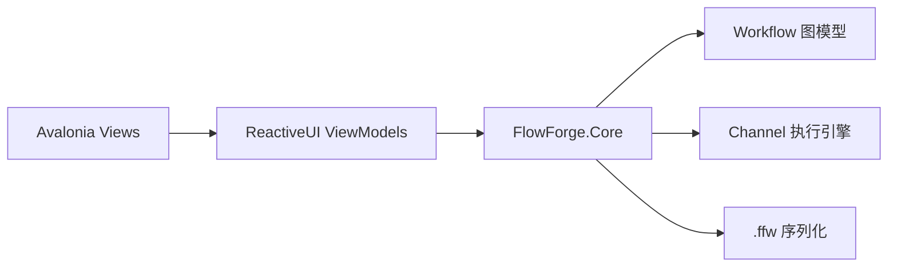

# FlowForge

FlowForge 是一个本地运行的节点式 AI 工作流编辑器，使用 Avalonia 和 .NET 8 构建。当前已完成画布编辑、强类型执行引擎、`.ffw` 持久化、LLM 节点和撤销/重做的 Stage 4 能力。

## 已实现能力

- 自绘画布支持节点投放、拖动、多选、端口类型校验和贝塞尔连线。
- Core 层提供受控 `Workflow` 聚合、Kahn 拓扑排序、基于 Channel 的流式调度、取消和失败传播。
- 内置 CSV/文本数据源、JSON 解析、文本拼接、控制台输出、OpenAI 与 DeepSeek 节点。
- `.ffw` schema v1 支持节点位置、配置和连线的加载保存，并提供 v0→v1 迁移框架。
- 文件菜单提供新建、打开、保存和另存为；Ctrl+Z、Ctrl+Y、Ctrl+Shift+Z 支持撤销重做。
- API Key 只通过 `apiKeySecretId` 引用保存，Windows 使用 DPAPI，macOS/Linux 通过系统密钥服务适配器处理。

## 架构



## 快速开始

```powershell
dotnet restore
dotnet run --project src/FlowForge.App/FlowForge.App.csproj
dotnet test FlowForge.sln --configuration Release
```

## 示例工作流

- `samples/csv-to-console.ffw`：读取 CSV 后流式输出到控制台。
- `samples/csv-summarize-with-llm.ffw`：读取包含 CSV 内容的提示词，交给 OpenAI 节点生成摘要，再输出到控制台。

第二个样例不包含明文 API Key。运行前请把对应 Key 存入系统密钥存储，并让节点配置中的 `apiKeySecretId` 指向该引用。集成测试使用 fake HTTP 与内存密钥存储，不会调用真实模型服务。

## 当前边界

Stage 4 已覆盖持久化、LLM、文件菜单和撤销重做。属性面板自动生成、剩余转换/写文件节点、性能优化、插件和发布流程将在后续阶段完成。

## 关键决策

- [ADR-0003](docs/decisions/0003-core-execution-contracts.md)：Channel 流式执行与核心图模型。
- [ADR-0007](docs/decisions/0007-stage4-persistence-and-security-contracts.md)：密钥引用、`.ffw` 持久化和撤销历史。

## 协议

MIT
