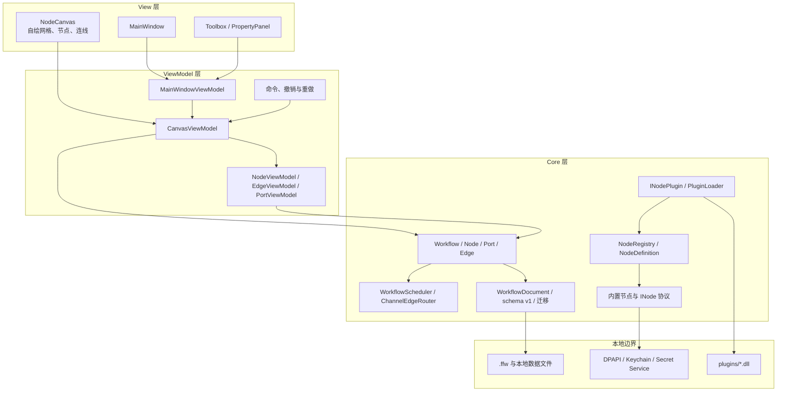
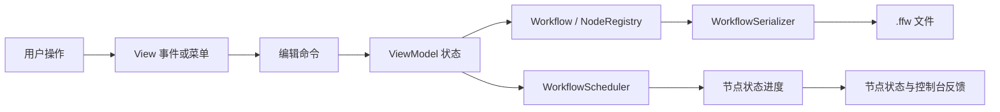
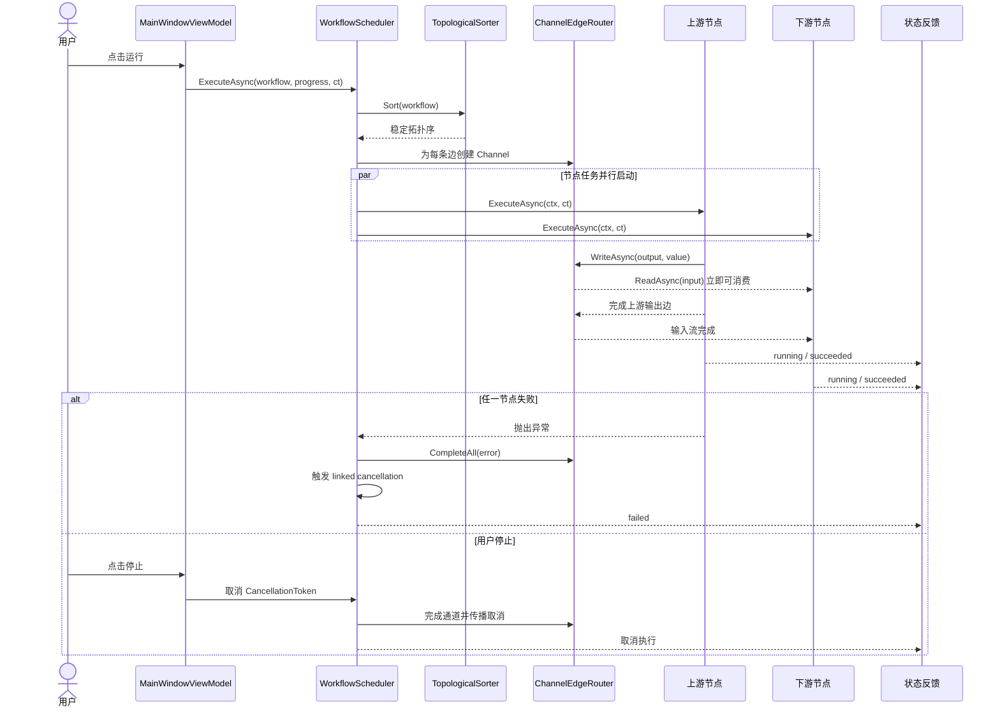
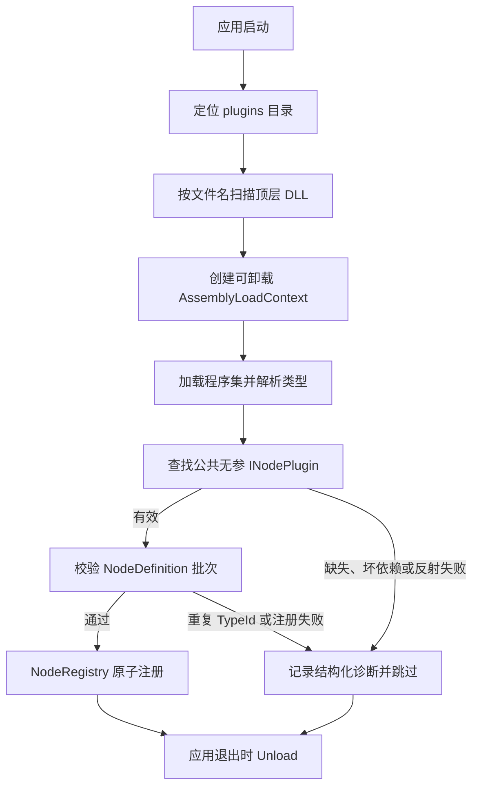

# FlowForge 架构总览

FlowForge 是一个本地桌面应用。Avalonia View 负责交互和绘制，ReactiveUI ViewModel 负责可观察状态与命令，`FlowForge.Core` 负责工作流领域模型、节点协议、执行引擎、序列化和插件契约。文件系统与系统密钥服务属于应用边界适配器，不进入 Core 的 UI 依赖。

## 整体分层

### View 层

`MainWindow` 组合三栏布局。`NodeCanvas` 继承 Avalonia `Control`，负责网格背景、world/view 坐标变换、节点和贝塞尔边绘制，以及指针拖拽和端口连线手势。节点和连线的可见对象由 retained operation 承载；视口剔除在进入场景前完成。

View 不直接创建 Core 节点，也不直接写 `.ffw`。交互通过绑定命令和 ViewModel 暴露的状态完成，这样 ViewModel 测试不需要 UI 线程。

### ViewModel 层

- `MainWindowViewModel` 管理文件生命周期、运行/停止、插件诊断和全局状态。
- `CanvasViewModel` 管理节点、边、选择、视口和工作流编辑操作。
- `NodeViewModel`、`PortViewModel`、`EdgeViewModel` 将 Core 节点协议映射到画布可观察状态。
- `ICommand` 实现增删节点、增删连线、移动、属性修改和批量操作；撤销与重做只改变编辑状态，不改变 Core 执行语义。

### Core 层

Core 保持 Avalonia 无关。`Workflow` 负责节点和边的引用校验、端口方向、类型兼容和单输入连接约束；`TopologicalSorter` 使用稳定的 Kahn 算法检测环；`WorkflowScheduler` 为节点建立并行任务，并使用 `ChannelEdgeRouter` 为每条边提供独立数据通道。

`NodeRegistry` 是节点定义的统一入口。Toolbox 创建、`.ffw` 反序列化、属性面板和运行时都使用同一份 `NodeDefinition`，避免“画布能显示但文件不能加载”这类分裂状态。

## 用户操作与数据流

编辑流程以 ViewModel 为单一状态入口：例如拖动节点时，画布把指针位移转换成 world 坐标，`CanvasViewModel` 更新节点位置并记录一个移动命令；节点位置变化只刷新相关 retained operation 和关联边。

保存流程先从当前画布构造 `WorkflowDocument`，再由 `WorkflowSerializer` 使用 `System.Text.Json` 写入 UTF-8 `.ffw`。打开流程先升级 schema，再通过 `NodeRegistry` 创建所有节点、校验边并整体替换画布，失败时不会留下半加载状态。LLM 配置只保存 `apiKeySecretId`，实际密钥由系统密钥存储读取。

## 执行引擎时序

运行采用流式语义：节点任务由调度器统一启动，但下游通过自己的输入 Channel 等待数据，不需要等上游节点完全结束。单节点异常会让工作流失败，已完成节点不会回滚；节点必须检查 `CancellationToken`，用户停止时沿所有执行上下文协作取消。

## 插件加载流程

插件必须显式实现 `INodePlugin` 并返回 `IReadOnlyList<NodeDefinition>`，不扫描任意 `INode` 类型。插件上下文解析 `FlowForge.Core` 时回退到 Default 加载上下文，从而保持 `INode`、`IPort`、`NodeDefinition` 和 `INodePlugin` 的类型身份一致。加载失败只影响当前 DLL；应用关闭时统一注销已注册的 TypeId 并卸载上下文。

## 约束与验证边界

- Core 单元测试覆盖图校验、拓扑排序、Channel 路由、节点、序列化、迁移和插件加载。
- App 测试覆盖 ViewModel、画布视口、retained operation、命令和属性面板，并保持无 UI 线程依赖。
- 集成测试从真实 `.ffw` 文件加载并执行 CSV 工作流。
- 1000 节点 FPS 和 WorkingSet64 只采用真实 Release 窗口采样；无头测试不伪造渲染器指标。
- Avalonia 11.2.3 的公开 `SceneInvalidated` 是 root 级通知，不能被解释为内部 dirty tracker 的局部区域证明；这一边界记录在 [ADR-0004](decisions/0004-viewport-virtualization.md)。
